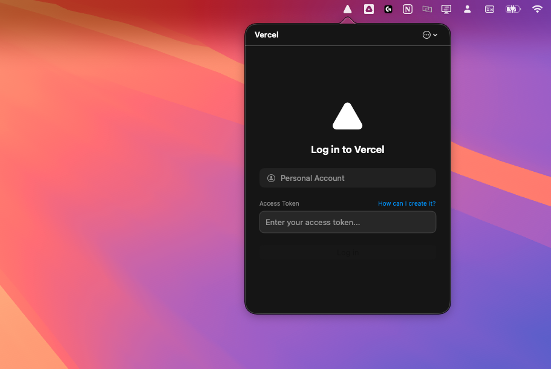
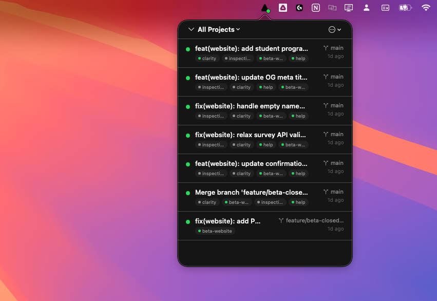
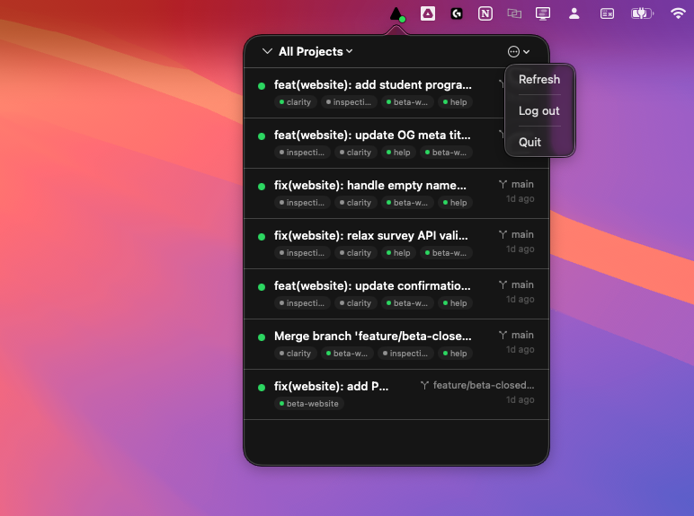

<p align="center">
  
</p>

<h1 align="center">VercelDeploys</h1>

<p align="center">
  A lightweight macOS menu bar app to monitor your Vercel deployments in real time.
</p>

<p align="center">
  
  
  <a href="LICENSE"></a>
</p>

---

<p align="center">
  
  &nbsp;&nbsp;
  
  &nbsp;&nbsp;
  
</p>

---

## Features

- **Menu Bar App** — Lives in your menu bar with a Vercel-inspired triangle icon and a colored status dot reflecting your latest deployment state
- **Grouped by Commit** — Deployments are grouped by commit SHA, so monorepo deploys triggered by the same push appear together
- **Live Status** — Color-coded indicators for each state: Ready, Building, Error, Queued, Initializing, and Canceled
- **Project Filtering** — Filter deployments by project using the dropdown menu
- **Deployment Details** — Drill into any deployment to see commit info, branch, SHA, creator, preview URL, and a link to the Vercel inspector
- **macOS Notifications** — Get notified when deployments succeed or fail, with distinct sounds for each
- **Auto-Refresh** — Deployments refresh every 30 seconds in the background, even when the popover is closed
- **Secure Token Storage** — Your Vercel API token is stored in the macOS Keychain, never in plaintext

## Installation

### Download

Grab the latest `.dmg` from the [Releases](../../releases) page, open it, and drag **VercelDeploys** to your Applications folder.

### Build from Source

Requirements: macOS 14+ and Xcode Command Line Tools.

```bash
git clone https://github.com/7vision-dev/VercelDeploys.git
cd VercelDeploys
chmod +x build.sh
./build.sh
```

The built `.dmg` will be at `build/VercelDeploys.dmg`.

Alternatively, open `VercelDeploys.xcodeproj` in Xcode and build directly.

## Setup

1. Launch **VercelDeploys** — a triangle icon appears in your menu bar
2. Click the icon and enter your [Vercel Access Token](https://vercel.com/account/tokens)
3. Your deployments will appear immediately

> Your token is validated against the Vercel API before being saved, and is stored securely in the macOS Keychain.

## Usage

| Action | How |
|---|---|
| View deployments | Click the menu bar icon |
| Filter by project | Use the dropdown in the top-left corner |
| View commit details | Click a deployment group row |
| View deployment details | Click a specific project within a group |
| Open preview URL | Click the Safari icon on a deployment |
| Open Vercel inspector | Click the arrow icon on a deployment |
| Refresh manually | Click the menu (top-right) → Refresh |
| Log out | Click the menu (top-right) → Log out |
| Quit | Click the menu (top-right) → Quit |

## Architecture

```
VercelDeploys/
├── VercelDeploysApp.swift        # App entry point
├── AppDelegate.swift             # Menu bar icon & popover management
├── Models/
│   └── Deployment.swift          # Data models (Deployment, DeploymentGroup, DeploymentState)
├── Services/
│   ├── VercelAPIClient.swift     # Vercel API integration (actor-based, thread-safe)
│   └── KeychainHelper.swift      # macOS Keychain wrapper for secure token storage
├── ViewModels/
│   └── AppViewModel.swift        # Central state management & background refresh
└── Views/
    ├── ContentView.swift         # Root container with top bar & navigation
    ├── LoginView.swift           # Token input & validation
    ├── DeploymentListView.swift  # Grouped deployment list
    ├── GroupDetailView.swift     # Commit-level detail view
    └── DeploymentDetailView.swift # Individual deployment detail view
```

**Key technical choices:**

- **Swift 6 concurrency** — `VercelAPIClient` is an actor for thread-safe API access
- **SwiftUI + AppKit** — SwiftUI for all views, AppKit for `NSStatusItem` menu bar integration
- **No dependencies** — Zero third-party libraries; uses only Apple frameworks (SwiftUI, AppKit, Security, UserNotifications)

## Contributing

Contributions are welcome! Feel free to open an issue or submit a pull request.

1. Fork the repository
2. Create your feature branch (`git checkout -b feature/my-feature`)
3. Commit your changes (`git commit -m 'Add my feature'`)
4. Push to the branch (`git push origin feature/my-feature`)
5. Open a Pull Request

## Disclaimer

This project is not affiliated with, endorsed by, or sponsored by Vercel Inc. The Vercel name, logo, and related trademarks are the property of Vercel Inc. This is an independent, community-built tool that uses the publicly available [Vercel API](https://vercel.com/docs/rest-api).

## License

This project is licensed under the MIT License — see the [LICENSE](LICENSE) file for details.
